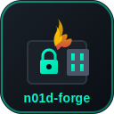

# n01d-forge

<p align="center">
  
</p>

<p align="center">
  <strong>🔥 Secure Cross-Platform Image Burner with Encryption</strong><br>
  <em>Flash • Encrypt • Verify • Secure</em>
</p>

<p align="center">
  <a href="#features">Features</a> •
  <a href="#security">Security</a> •
  <a href="#download">Download</a> •
  <a href="#usage">Usage</a> •
  <a href="#building">Building</a>
</p>

<p align="center">
  
  
  
  
</p>

---

## What is n01d-forge?

**n01d-forge** is a secure, cross-platform image burning tool similar to Balena Etcher, but with advanced security features including full-disk encryption, secure erase, and hash verification. Perfect for creating bootable USB drives with security in mind.

---

## Features

### 🔥 Image Flashing
- **Multiple Formats** - ISO, IMG, RAW, DMG, BIN
- **High Performance** - 4MB buffer for fast writes
- **Progress Tracking** - Real-time speed, ETA, and bytes written
- **Auto-Detection** - Automatically detect USB and removable drives

### 🔐 Encryption Support
- **LUKS/LUKS2** - Linux Unified Key Setup (Linux native)
- **VeraCrypt** - Cross-platform encryption container
- **Multiple Ciphers** - AES-256-XTS, Serpent, Twofish
- **Strong Key Derivation** - Argon2id with configurable iterations

### 🛡️ Security Features
- **Secure Erase** - Zero fill, random data, DoD 5220.22-M, Gutmann (35-pass)
- **Hash Verification** - SHA-256, SHA-512, MD5 before and after write
- **Wipe on Error** - Automatically wipe encryption headers on failure
- **Safe Drive Selection** - System drives are protected

### ⚙️ Bootloader Options
- **UEFI** - Modern UEFI boot support
- **Legacy BIOS** - Traditional MBR boot support
- **Hybrid** - Both UEFI and Legacy for maximum compatibility

### 🎨 User Interface
- **Modern Dark UI** - Cyberpunk-inspired theme matching n01d-machine
- **Step-by-Step Wizard** - Easy 3-step process
- **Confirmation Dialogs** - Prevent accidental data loss
- **Real-time Progress** - Visual progress with speed and ETA

---

## Security

### 🔐 Encryption Types

| Type | Platform | Description |
|------|----------|-------------|
| **LUKS2** | Linux | Latest LUKS standard with Argon2id |
| **LUKS** | Linux | Legacy LUKS for older systems |
| **VeraCrypt** | All | Cross-platform, plausible deniability |

### 🔑 Encryption Ciphers

| Cipher | Key Size | Description |
|--------|----------|-------------|
| **AES-256-XTS** | 512-bit | Industry standard, hardware accelerated |
| **Serpent-XTS** | 512-bit | Conservative design, very secure |
| **Twofish-XTS** | 512-bit | Fast, no known weaknesses |

### 🧹 Secure Erase Methods

| Method | Passes | Description |
|--------|--------|-------------|
| **Zero Fill** | 1 | Fast, fills with zeros |
| **Random** | 1 | Cryptographically random data |
| **DoD 5220.22-M** | 3 | U.S. Department of Defense standard |
| **Gutmann** | 35 | Maximum security for older drives |

### ✓ Verification

- **Pre-write Hash** - Calculate SHA-256 of source image
- **Post-write Verify** - Read back and compare hash
- **Mismatch Alert** - Clear warning if verification fails

---

## Download

### Latest Release (v1.0.0)

| Platform | Download |
|----------|----------|
| 🐧 Linux (AppImage) | [n01d-forge_1.0.0_amd64.AppImage](https://github.com/bad-antics/n01d-forge/releases/latest) |
| 🐧 Linux (Debian) | [n01d-forge_1.0.0_amd64.deb](https://github.com/bad-antics/n01d-forge/releases/latest) |
| 🪟 Windows | [n01d-forge_1.0.0_x64-setup.exe](https://github.com/bad-antics/n01d-forge/releases/latest) |
| 🍎 macOS | [n01d-forge_1.0.0_x64.dmg](https://github.com/bad-antics/n01d-forge/releases/latest) |

---

## Prerequisites

### Required Tools

#### Linux
```bash
# For image writing (usually pre-installed)
sudo apt install coreutils

# For encryption (optional)
sudo apt install cryptsetup

# For secure erase (optional)
sudo apt install util-linux
```

#### Windows
- Administrator privileges required
- No additional tools needed

#### macOS
- Administrator privileges required
- No additional tools needed

---

## Usage

### Basic Image Flash

1. **Select Image** - Click "Browse" and choose your ISO/IMG file
2. **Select Drive** - Click on the target USB drive
3. **Flash** - Click "Flash Image" and confirm

### Encrypted Bootable USB

1. Select your image file
2. Select target drive
3. Enable **"Enable Encryption"** toggle
4. Choose encryption type (LUKS2 recommended for Linux)
5. Set a strong password
6. Click "Flash Image"

### Secure Erase Before Write

1. Select image and drive
2. Enable **"Secure Erase First"** toggle
3. Choose erase method:
   - **Zero Fill** - Fast, good for SSDs
   - **Random** - Better for HDDs
   - **DoD** - Government standard
   - **Gutmann** - Maximum security
4. Proceed with flash

### Verify After Write

1. Enable **"Verify After Write"** (enabled by default)
2. After writing, n01d-forge will:
   - Read back the written data
   - Calculate SHA-256 hash
   - Compare with source hash
   - Show verification result

---

## Building from Source

### Prerequisites

- Rust 1.70+
- Node.js 18+ (optional)
- Platform-specific dependencies

### Linux

```bash
# Install dependencies
sudo apt install libgtk-3-dev libwebkit2gtk-4.0-dev libappindicator3-dev librsvg2-dev

# Clone repository
git clone https://github.com/bad-antics/n01d-forge.git
cd n01d-forge

# Build
cargo install tauri-cli
cargo tauri build
```

### Windows

```powershell
# Clone repository
git clone https://github.com/bad-antics/n01d-forge.git
cd n01d-forge

# Build
cargo install tauri-cli
cargo tauri build
```

### macOS

```bash
# Clone repository
git clone https://github.com/bad-antics/n01d-forge.git
cd n01d-forge

# Build
cargo install tauri-cli
cargo tauri build
```

---

## Project Structure

```
n01d-forge/
├── public/
│   └── index.html          # Web UI
├── src-tauri/
│   ├── src/
│   │   ├── main.rs         # Main application logic
│   │   ├── encryption.rs   # Encryption module
│   │   ├── drives.rs       # Drive detection
│   │   └── secure_erase.rs # Secure erase methods
│   ├── Cargo.toml          # Rust dependencies
│   └── tauri.conf.json     # Tauri configuration
├── assets/
│   └── n01d-forge-icon.svg # Application icon
├── .github/
│   └── workflows/
│       └── release.yml     # CI/CD
└── README.md
```

---

## Related Projects

- [n01d-machine](https://github.com/bad-antics/n01d-machine) - Secure VM Manager with Sandboxing & Tor
- [nullsec](https://github.com/bad-antics/nullsec) - Security research framework

---

## Contributing

Contributions are welcome! Please feel free to submit a Pull Request.

---

## License

MIT License - see [LICENSE](LICENSE)

---

<p align="center">
  Made with 🔥 by <a href="https://github.com/bad-antics">NullSec Team</a>
</p>

<p align="center">
  <sub>🔒 Forge your security</sub>
</p>
